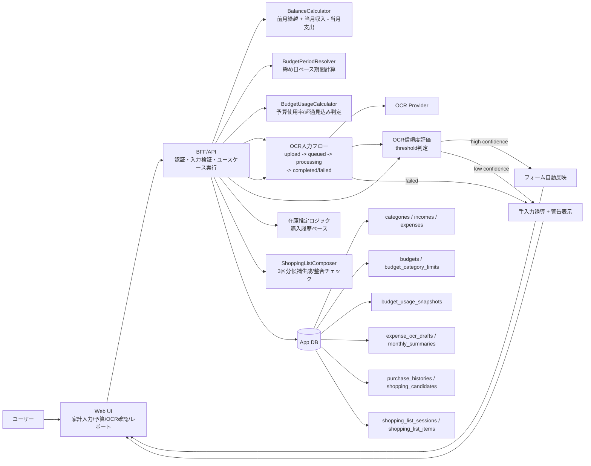

# Application Architecture: 一人暮らし支援アプリ（節約・家計管理）v1

## 変更前整理（目的 / 影響範囲 / 検証方法）
- 目的: MVP実装時の責務整理を維持しつつ、予算管理MVP差分で発生したコンフリクトを解消して実装参照点を一本化する。
- 影響範囲: Webフロントエンド、BFF/API、ドメインサービス、予算関連DB参照、図表（flowchart/sequence）。
- 検証方法: mermaid図と責務マップが `task` / `data-model` ドキュメントの記述と矛盾しないことを確認する。

## コンフリクト解消方針
- 競合した予算関連差分は `BudgetUsageCalculator` と `budget_usage_snapshots` を採用し、構成図・責務マップ・処理フローで同一表現に統一する。
- UIは表示責務、判定（使用率算出/超過見込み判定）はドメイン責務とする方針を明示し、計算ロジックの重複を防止する。

## 構成方針
- Webフロントエンドを起点に、BFF/APIを介してドメインロジックへアクセスする。
- 残高計算・予算期間計算はドメインサービスに集約し、UI側で重複計算しない。
- 予算使用率計算・超過見込み判定はドメインサービスに集約し、UI側は表示責務に限定する。
- OCRは外部プロバイダの結果を `expense_ocr_drafts` に保存し、ユーザー確定後に `expenses` へ反映する。
- OCR失敗時または低信頼時は、手入力導線へフォールバックし、レシート画像参照付きで編集を継続可能にする。
- 集計・在庫推定は DB 上の履歴を参照して `monthly_summaries` / `shopping_candidates` を更新する。

## システム構成図（mermaid）


## 実装責務マップ
1. フロントエンド
   - 入力フォーム、OCR結果編集、予算設定、レポート表示を実装する。
2. BFF/API
   - 各ユースケースの入口としてバリデーション・権限チェック・トランザクション境界を実装する。
3. ドメインサービス
   - `BalanceCalculator` / `BudgetPeriodResolver` / `BudgetUsageCalculator` を単一責務で実装する。
4. データアクセス
   - `data-model-solo-life-support-v1.md` のスキーマに沿って永続化処理を実装する。
5. 外部連携
   - OCR結果を暫定データとして保存し、確定時のみ支出計上する。
   - OCR失敗時・低信頼時は `expenses` へ自動計上せず、ユーザー手入力を必須化する。
6. バッチ/集計
   - 月次集計更新と買い物候補更新を定期実行またはイベント駆動で実装する。
7. 買い物リスト生成ユースケース
   - `ShoppingListComposer` で候補を「定期購入品 / 在庫切れ推定品 / 予算内候補」に分類して返す。
   - 各候補には `last_purchased_on` と `estimated_interval_days` を付与する。
   - `data_quality=limited` の場合はUI向けに「推定精度低下」フラグを返し、手動編集導線を有効化する。
   - 確定前に `remaining_budget - candidate_total_amount` を計算し、超過時は確定不可レスポンスを返す。

## 予算管理MVPの処理フロー（Sprint 2）
```mermaid
sequenceDiagram
    participant U as User
    participant FE as Budget Settings UI
    participant API as Budget API
    participant BR as BudgetPeriodResolver
    participant BU as BudgetUsageCalculator
    participant DB as App DB

    U->>FE: 締め日・総額予算・カテゴリ予算を入力
    FE->>API: 保存/更新リクエスト
    API->>BR: 基準日+締め日から期間を解決
    BR-->>API: period_start/period_end
    API->>DB: budgets, budget_category_limits をupsert
    API->>BU: 期間内実績から使用率/超過見込みを算出
    BU->>DB: budget_usage_snapshots を保存
    API-->>FE: 使用率と超過見込みカテゴリを返却
    FE-->>U: 使用率表示 + 超過見込みカテゴリを強調表示
## OCR統合シーケンス（Sprint 2）
```mermaid
sequenceDiagram
    participant U as User
    participant FE as Web UI
    participant API as BFF/API
    participant OCR as OCR Provider
    participant DB as App DB

    U->>FE: レシート画像をアップロード
    FE->>API: OCR下書き作成リクエスト
    API->>DB: expense_ocr_drafts(status=queued)
    API->>OCR: OCR実行
    OCR-->>API: 抽出結果 + confidence
    API->>DB: expense_ocr_drafts更新(completed/failed)
    API-->>FE: 抽出結果 or 失敗理由

    alt 高信頼
      FE->>U: 自動入力結果を表示（編集可能）
    else 低信頼 or 失敗
      FE->>U: 警告表示 + 手入力誘導
    end

    U->>FE: 確定前に値を編集
    FE->>API: 支出確定
    API->>DB: expenses(source_type=ocr|manual, status=confirmed)
    API->>DB: monthly_summaries再計算トリガ
```

## 関連ドキュメント
- `docs/ssd/task-solo-life-support-v1.md`
- `docs/ssd/data-model-solo-life-support-v1.md`
- `docs/ssd/pre-implementation-decisions-solo-life-support-v1.md`

## 買い物リストAPI（MVP）
### `POST /api/shopping-list/sessions/generate`
- 入力: `target_date`, `budget_id`（任意）。
- 出力: 3区分候補、推定根拠、`data_quality`、`remaining_budget_snapshot`。

### `PATCH /api/shopping-list/sessions/:id/items`
- 入力: 追加/削除/数量変更/価格変更/メモ変更。
- 出力: 更新後の候補一覧、`candidate_total_amount`、`balance_delta_amount`。

### `POST /api/shopping-list/sessions/:id/confirm`
- 入力: なし（最新編集内容を確定）。
- 処理: 予算整合チェックを再実行し、問題なければ `status=confirmed` で保存。
- エラー: `BUDGET_OVERFLOW`（候補合計が予算残を超過）。
