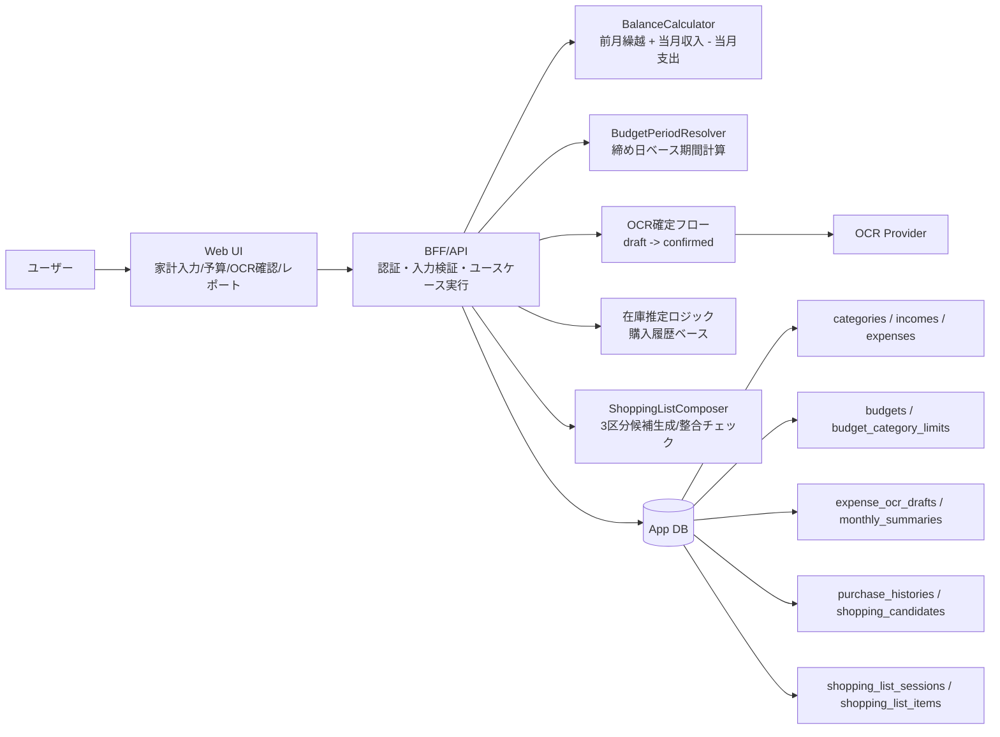

# Application Architecture: 一人暮らし支援アプリ（節約・家計管理）v1

## 変更前整理（目的 / 影響範囲 / 検証方法）
- 目的: MVP実装時に、どのレイヤで何を実装するかを明確にし、開発者間で構成認識を揃える。
- 影響範囲: Webフロントエンド、BFF/API、ドメインサービス、外部OCR連携、DB設計。
- 検証方法: 構成図と実装ステップが task / data-model ドキュメントと矛盾しないことをレビューする。

## 構成方針
- Webフロントエンドを起点に、BFF/APIを介してドメインロジックへアクセスする。
- 残高計算・予算期間計算はドメインサービスに集約し、UI側で重複計算しない。
- OCRは外部プロバイダの結果を `expense_ocr_drafts` に保存し、ユーザー確定後に `expenses` へ反映する。
- 集計・在庫推定は DB 上の履歴を参照して `monthly_summaries` / `shopping_candidates` を更新する。

## システム構成図（mermaid）

## 実装責務マップ
1. フロントエンド
   - 入力フォーム、OCR結果編集、予算設定、レポート表示を実装する。
2. BFF/API
   - 各ユースケースの入口としてバリデーション・権限チェック・トランザクション境界を実装する。
3. ドメインサービス
   - `BalanceCalculator` と `BudgetPeriodResolver` を単一責務で実装する。
4. データアクセス
   - `data-model-solo-life-support-v1.md` のスキーマに沿って永続化処理を実装する。
5. 外部連携
   - OCR結果を暫定データとして保存し、確定時のみ支出計上する。
6. バッチ/集計
   - 月次集計更新と買い物候補更新を定期実行またはイベント駆動で実装する。
7. 買い物リスト生成ユースケース
   - `ShoppingListComposer` で候補を「定期購入品 / 在庫切れ推定品 / 予算内候補」に分類して返す。
   - 各候補には `last_purchased_on` と `estimated_interval_days` を付与する。
   - `data_quality=limited` の場合はUI向けに「推定精度低下」フラグを返し、手動編集導線を有効化する。
   - 確定前に `remaining_budget - candidate_total_amount` を計算し、超過時は確定不可レスポンスを返す。

## 関連ドキュメント
- `docs/ssd/task-solo-life-support-v1.md`
- `docs/ssd/data-model-solo-life-support-v1.md`
- `docs/ssd/pre-implementation-decisions-solo-life-support-v1.md`

## 買い物リストAPI（MVP）
### `POST /api/shopping-list/sessions/generate`
- 入力: `target_date`, `budget_id`（任意）。
- 出力: 3区分候補、推定根拠、`data_quality`、`remaining_budget_snapshot`。

### `PATCH /api/shopping-list/sessions/:id/items`
- 入力: 追加/削除/数量変更/価格変更/メモ変更。
- 出力: 更新後の候補一覧、`candidate_total_amount`、`balance_delta_amount`。

### `POST /api/shopping-list/sessions/:id/confirm`
- 入力: なし（最新編集内容を確定）。
- 処理: 予算整合チェックを再実行し、問題なければ `status=confirmed` で保存。
- エラー: `BUDGET_OVERFLOW`（候補合計が予算残を超過）。
