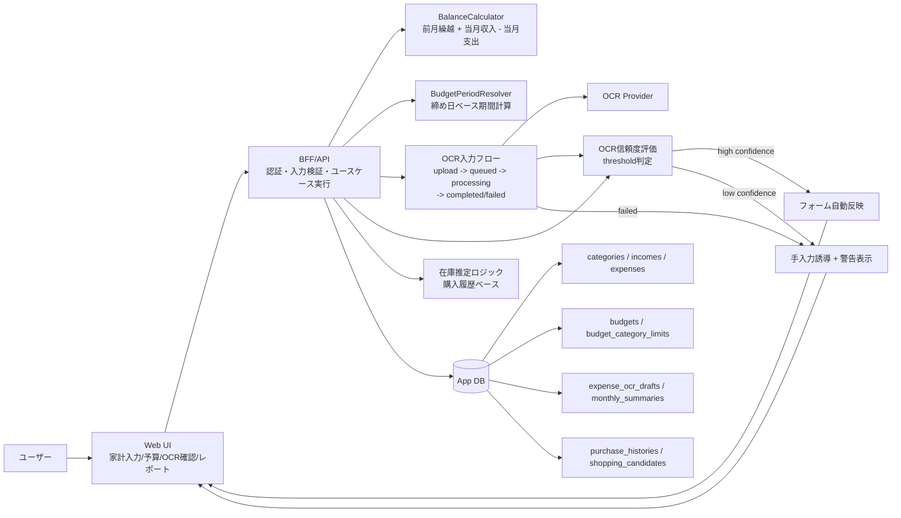

# Application Architecture: 一人暮らし支援アプリ（節約・家計管理）v1

## 変更前整理（目的 / 影響範囲 / 検証方法）
- 目的: MVP実装時に、どのレイヤで何を実装するかを明確にし、開発者間で構成認識を揃える。
- 影響範囲: Webフロントエンド、BFF/API、ドメインサービス、外部OCR連携、DB設計。
- 検証方法: 構成図と実装ステップが task / data-model ドキュメントと矛盾しないことをレビューする。

## 構成方針
- Webフロントエンドを起点に、BFF/APIを介してドメインロジックへアクセスする。
- 残高計算・予算期間計算はドメインサービスに集約し、UI側で重複計算しない。
- OCRは外部プロバイダの結果を `expense_ocr_drafts` に保存し、ユーザー確定後に `expenses` へ反映する。
- OCR失敗時または低信頼時は、手入力導線へフォールバックし、レシート画像参照付きで編集を継続可能にする。
- 集計・在庫推定は DB 上の履歴を参照して `monthly_summaries` / `shopping_candidates` を更新する。

## システム構成図（mermaid）

## 実装責務マップ
1. フロントエンド
   - 入力フォーム、OCR結果編集、予算設定、レポート表示を実装する。
2. BFF/API
   - 各ユースケースの入口としてバリデーション・権限チェック・トランザクション境界を実装する。
3. ドメインサービス
   - `BalanceCalculator` と `BudgetPeriodResolver` を単一責務で実装する。
4. データアクセス
   - `data-model-solo-life-support-v1.md` のスキーマに沿って永続化処理を実装する。
5. 外部連携
   - OCR結果を暫定データとして保存し、確定時のみ支出計上する。
   - OCR失敗時・低信頼時は `expenses` へ自動計上せず、ユーザー手入力を必須化する。
6. バッチ/集計
   - 月次集計更新と買い物候補更新を定期実行またはイベント駆動で実装する。

## OCR統合シーケンス（Sprint 2）

## 関連ドキュメント
- `docs/ssd/task-solo-life-support-v1.md`
- `docs/ssd/data-model-solo-life-support-v1.md`
- `docs/ssd/pre-implementation-decisions-solo-life-support-v1.md`
