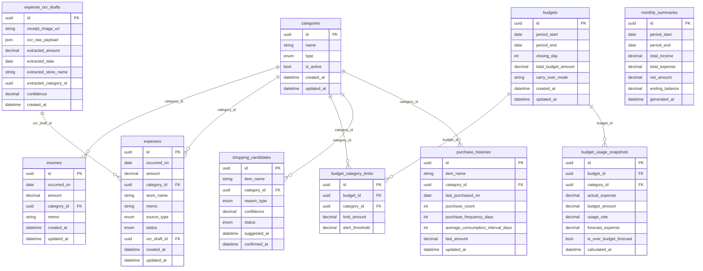

# Data Model: 一人暮らし支援アプリ（節約・家計管理）v1

## 変更前整理（目的 / 影響範囲 / 検証方法）
- 目的: 家計・予算・OCR・買い物候補の整合した永続化モデルを先に固定し、後続実装の手戻りを減らす。
- 影響範囲: DBスキーマ定義、ドメインモデル、集計ロジック、OCR確定フロー。
- 検証方法: スキーマ定義レビュー + 残高計算/予算期間計算の単体テストケース作成。

## スキーマ定義
### 基本マスタ/取引
- `categories`
  - `id`, `name`, `type`(income/expense), `is_active`, `created_at`, `updated_at`。
- `incomes`
  - `id`, `occurred_on`, `amount`, `category_id`, `memo`, `created_at`, `updated_at`。
- `expenses`
  - `id`, `occurred_on`, `amount`, `category_id`, `store_name`, `memo`, `source_type`(manual/ocr), `status`(draft/confirmed), `ocr_draft_id`, `created_at`, `updated_at`。
- `budgets`
  - `id`, `period_start`, `period_end`, `closing_day`, `total_budget_amount`, `carry_over_mode`, `created_at`, `updated_at`。
- `budget_category_limits`
  - `id`, `budget_id`, `category_id`, `limit_amount`, `alert_threshold`。
- `monthly_summaries`
  - `id`, `period_start`, `period_end`, `total_income`, `total_expense`, `net_amount`, `ending_balance`, `generated_at`。
- `shopping_candidates`
  - `id`, `item_name`, `category_id`, `reason_type`(inventory_prediction/manual), `confidence`, `status`(suggested/confirmed/dismissed), `suggested_at`, `confirmed_at`。

## ドメインロジック定義
### 残高計算式を単一責務で扱う
- `BalanceCalculator`（ドメインサービス）に「前月繰越 + 当月収入 - 当月支出」を集約する。
- 画面表示/API/集計バッチは直接計算せず、必ず同サービスを経由する。
- 入力: `period_start`, `period_end`, `opening_balance`。出力: `total_income`, `total_expense`, `ending_balance`。

### 締め日ベースの予算期間計算ロジック
- `BudgetPeriodResolver`を作成し、基準日(`base_date`)と`closing_day`から`period_start`/`period_end`を返す。
- 例: 締め日25日、基準日2025-04-10の場合、期間は2025-03-26〜2025-04-25。
- 月末超過（29〜31日）時は当該月の末日を締め日として補正する。

### 予算使用率と超過見込みの判定ロジック
- `BudgetUsageCalculator`を追加し、総額・カテゴリ別の`usage_rate = actual_expense / budget_amount`を算出する。
- 返却値は `actual_expense`, `budget_amount`, `usage_rate`, `forecast_expense`, `is_over_budget_forecast` を持つ。
- `forecast_expense` は「当月日次平均支出 × 期間日数」で算出し、`forecast_expense > budget_amount` を超過見込み判定とする。
- UIの強調表示は `is_over_budget_forecast = true` を唯一の判定条件として統一する。

### 締め日前後の集計境界ルール
- 予算集計の対象は `occurred_on >= period_start AND occurred_on <= period_end`（両端含む）で固定する。
- 例: 締め日25日の場合、4/25支出は当月、4/26支出は翌月へ計上する。
- タイムゾーンは `Asia/Tokyo` 固定で日付丸めを行い、UTC日跨ぎによる二重計上/未計上を防ぐ。

## OCR暫定値と確定データ
- `expense_ocr_drafts`
  - `id`, `receipt_image_url`, `ocr_raw_payload`, `extracted_amount`, `extracted_date`, `extracted_store_name`, `extracted_category_id`, `confidence`, `created_at`。
- `expenses.status`で`draft`/`confirmed`を区別し、確定時に`expense_ocr_drafts.id`を参照履歴として保持する（`ocr_draft_id`）。
- 確定操作前は暫定値を編集可能、確定後は通常の支出データとして集計対象にする。

## 在庫推定のための購入履歴
- `purchase_histories`
  - `id`, `item_name`, `category_id`, `last_purchased_on`, `purchase_count`, `purchase_frequency_days`, `average_consumption_interval_days`, `last_amount`, `updated_at`。
- `shopping_candidates`生成時に、`last_purchased_on`と`average_consumption_interval_days`から枯渇予測日を算出する。
- 学習初期（履歴不足）向けに`confidence`低下ルールを持たせる。

## ER図（mermaid.js）

