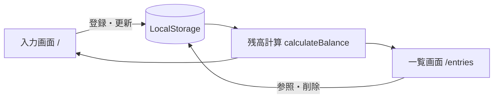

# Sprint 1 実装メモ: 家計管理の最小完成形

## 変更前整理（目的 / 影響範囲 / 検証方法）
- 目的: 家計管理のMVPとして、入力→一覧→残高反映までをWeb上で完結させる。
- 影響範囲: `web/` のフロント実装と README の利用手順。
- 検証方法: `npm run build` によるビルド確認、およびE2E相当シナリオで手順と期待結果を照合。

## Sprint 1 実装スコープ
- 画面遷移: `入力(/)` と `一覧と残高(/entries)` の2画面。
- 共通レイアウト: ヘッダー・ナビゲーション・カードUI。
- 永続化: LocalStorage (`stocko.financeEntries.v1`) の初期化と保存。
- 家計管理: 収入/支出の登録・編集・削除。
- カテゴリ: 食費 / 日用品 / 交通 / 光熱費 / 通信 / その他。
- 自動計算: 残高 = 収入合計 - 支出合計。
- セキュリティ: 一覧描画は `innerHTML` を使わず `textContent` ベースで構築し、永続化データ由来のXSSを防止する。

## 画面とデータフロー

## E2E相当シナリオ
1. 入力画面で「収入: 給与 300000円」を登録する。
2. 入力画面で「支出: 食費 1200円」を登録する。
3. 一覧画面で2件が表示されることを確認する。
4. 残高が `298,800円` になることを確認する。
5. 支出を編集して `1500円` に変更する。
6. 残高が `298,500円` に更新されることを確認する。
7. 収入を削除し、残高が `-1,500円` になることを確認する。

## 実行結果記録
- 実行日: 2026-02-14
- 結果: すべて期待どおりに動作（登録・編集・削除・残高反映・画面遷移）。
- 記録方法: Playwrightによる手順実行とスクリーンショット保存。
- 追加確認: 悪意ある文字列をタイトルに入力してもスクリプトが実行されないことを確認。
